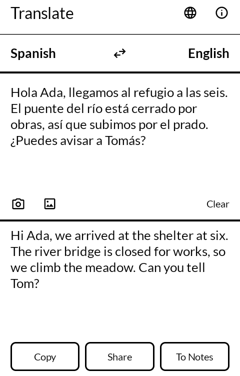
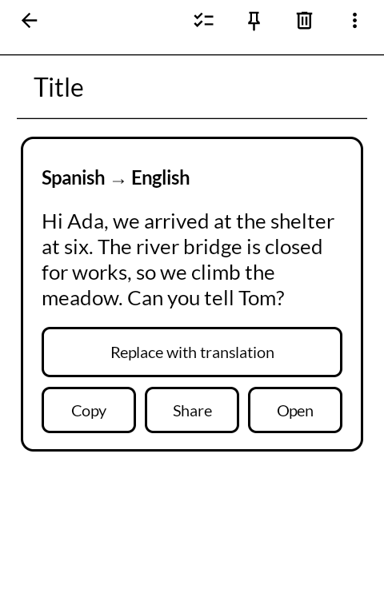
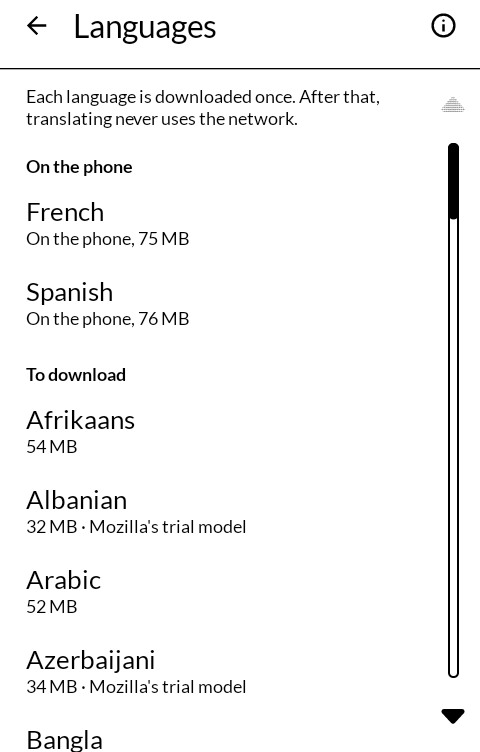
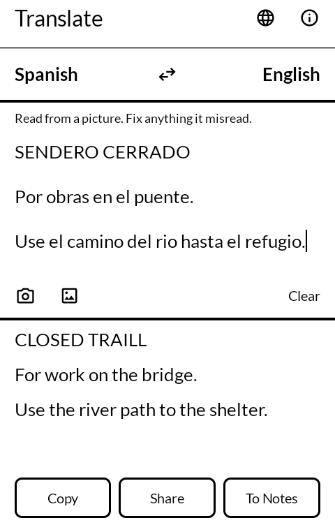

# Translate

通訳 *tsūyaku*

Translation on the phone, without sending the text anywhere: typed, pasted, selected in
another app, or read from a picture. On an E Ink phone, black on white, with nothing moving.

Built for the [Mudita Kompakt](https://mudita.com/products/kompakt/), whose 4.3" panel has
sixteen greys, a slow redraw, and is read outdoors as often as indoors.

## Screenshots

| | | | |
|---|---|---|---|
|  |  |  |  |

## What it does

- **Type or paste** in the upper half; the translation appears in the lower half when typing
  pauses. The way it goes is at the top, from and into; press either language to change it,
  and the arrows between them to turn it round, the translation becoming the text.
- **It notices the language.** Text that is plainly in another language on the phone switches
  the "from" side to it, until a language is chosen by hand.
- **Any two languages.** Every model goes to or from English, so French into German is French
  into English into German, done in one go; the English in between is never shown.
- **Scripts you may not read** get their sound in Latin letters under the translation: Greek,
  Cyrillic, Arabic, Hebrew, Japanese, Chinese, Korean, Thai and the scripts of India.
- **Copy, Share, To Notes** under the translation. "To Notes" is there when Notes is installed.
- **What is typed is kept** as it is typed, so a paragraph survives Android closing the app
  while you look something up elsewhere, and a restart of the phone.

## With the other apps

- **Translate in the selection menu.** Select text in Email, Messaging, Notes, Clippings or
  the Typewriter, open the ⋮, and choose Translate, next to Define. A panel opens over the app
  with the translation; Back closes it. Text in the language you read is translated into it;
  text already in it is taken for a reply and translated the other way. Where the selection
  is in a field you are writing in, **Replace with translation** puts it there in place of
  what was selected. Copy, Share and Open (in the app, to work on it) are there too.
- **Share text** to Translate from any app, and it opens with that text.
- **Share a picture** from Gallery, Camera or Files, or take one from the camera button: the
  words in it are read, put in the text field to be checked, and translated. A picture read in
  the wrong order or misread is easy to fix there before trusting the translation.
- The app's own text fields carry the same ⋮, so Define works on a word in the translation.

## Languages

Nothing is translated until a language is downloaded, from the languages screen (the globe at
the top). Each row says what it costs before anything is pressed: 15 to 80 MB to download,
about half as much again once unpacked. English needs nothing; it is in every pair.

59 languages are offered, each one way or both ways: Afrikaans, Albanian, Arabic,
Azerbaijani, Basque, Belarusian, Bengali, Bosnian, Bulgarian, Catalan, Chinese (Simplified and
Traditional), Croatian, Czech, Danish, Dutch, Estonian, Finnish, French, Galician, German,
Greek, Gujarati, Hebrew, Hindi, Hungarian, Icelandic, Indonesian, Italian, Japanese, Kannada,
Korean, Latvian, Lithuanian, Malay, Malayalam, Marathi, Norwegian (Bokmål, Nynorsk and
Norwegian), Persian, Polish, Portuguese, Romanian, Russian, Serbian, Slovak, Slovenian,
Spanish, Swedish, Tagalog, Tamil, Telugu, Thai, Turkish, Ukrainian, Urdu, Uyghur and
Vietnamese. A few of Mozilla's models are still trials, not yet released by Mozilla, and
their rows say so.

- **With an SD card in the phone, the models go on the card.** The small files for reading
  pictures stay on the phone.
- **A download stopped part way** keeps the files that came whole, and the next try fetches
  only the rest. Every file is checked on arrival, by length and, for the model itself, by
  the checksum Mozilla publishes; a file that fails is thrown away, not kept.
- **Pressing a language on the phone asks** ("Delete Spanish — tap again") and then deletes it.

Where the files come from:

| | From | Licence |
|---|---|---|
| Translation models | Mozilla's own store, the one Firefox translates pages from: `storage.googleapis.com/moz-fx-translations-data--303e-prod-translations-data`, as listed in its `db/models.json` | MPL 2.0 |
| Files for reading pictures | Tesseract's "fast" set, `github.com/tesseract-ocr/tessdata_fast`, pinned to commit `8741641` | Apache 2.0 |

The list of what there is, with every address and size, is `app/src/main/assets/catalog.json`,
written by `data/build-catalog.py` from Mozilla's list.

## Memory

On a phone this size, the models are most of what the app uses. It keeps only the one or two
models the language pair in use needs, and lets them go when Android asks for memory back; the
next translation loads them again.

## What it does not do

No speaking aloud, no listening, no documents, no web pages, no dictionary of its own (Define,
in the Dictionary app, covers that). No account, and nothing about what is translated is kept
except the text being worked on.

## Building

```
./gradlew assembleRelease
```

The translator itself is C++ (Bergamot, with Marian and SentencePiece inside it) and is
compiled with the app, so the build needs the Android NDK named in `app/build.gradle.kts`, and
the git submodules:

```
git submodule update --init --recursive
```

The APK carries both arm64 (the phone) and x86_64 (the emulator); `-Pabis=arm64-v8a` builds
the phone's alone.

A release is signed by a keystore in `signing/`, which is not in this repository. Without
it the release APK builds **unsigned** and will not install anywhere: there is no fallback
key by design.

## Credit

A fork of [Offline Translator](https://github.com/DavidVentura/offline-translator) by David
Ventura, GNU General Public License v3 or later, at its September 2025 state (`b6f7e7d`), with
its translation library as of `95cf1c8`. That is where the engine and its handling come from:
the Bergamot wrapper and its build, pivoting through English, recognising the language with
CLD2, reading pictures with Tesseract and putting the words back in reading order, and the
romanisation. Forum users on the Kompakt found it already worked well there. The screens are
written fresh in Jetpack Compose against [MMD](https://github.com/mudita/MMD), Mudita's E Ink
component library, and the language packs follow Mozilla's current store, which replaced the
one that version downloaded from.

Inside it:

- [Bergamot translator](https://github.com/browsermt/bergamot-translator), through
  [David Ventura's fork](https://github.com/DavidVentura/bergamot-translator), MPL 2.0, with
  [Marian](https://github.com/marian-nmt/marian-dev) (MIT) and
  [SentencePiece](https://github.com/google/sentencepiece) (Apache 2.0)
- [CLD2](https://github.com/CLD2Owners/cld2), Apache 2.0
- [Tesseract](https://github.com/tesseract-ocr/tesseract) through
  [Tesseract4Android](https://github.com/adaptech-cz/Tesseract4Android), Apache 2.0
- Icons from [Material Symbols](https://fonts.google.com/icons), Apache 2.0

## Licence

GNU General Public License v3.0 only. See [LICENSE](LICENSE). The files carried over from
Offline Translator keep their own notice, version 3 or any later version.

Copyright © wander wildwood.
